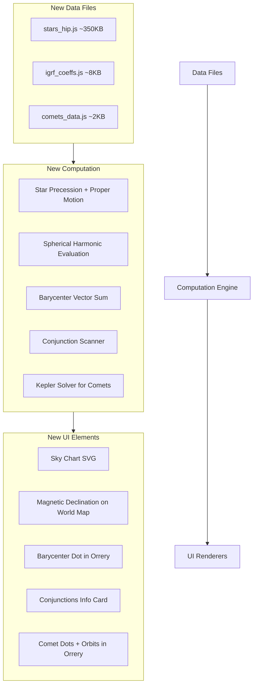

# Five Advanced First-Principles Features

## Architecture Overview

All five features integrate into the existing single-page app with external data files loaded via `<script>` tags. Each feature adds:
- A data file (JS, loaded at boot)
- Computation functions (in `index.html <script>`)
- A UI panel or visualization layer

Current file budget: ~4.2 MB used (vsop87 1.5MB + ELP 2.6MB + world 70KB + index 130KB). User budget: 20MB total. Remaining: ~15.8 MB.



---

## Feature 1: Real-Time Star Chart (~350 KB data)

### Data Source
- **Hipparcos New Reduction** (van Leeuwen 2007, catalog I/311) via VizieR
- Filter: `Hpmag < 6.5` (naked-eye stars) = ~9,100 stars
- Fields per star: HIP ID (omit), RA (rad, J2000), Dec (rad, J2000), pmRA (mas/yr), pmDE (mas/yr), Hpmag, B-V color index
- Also embed ~88 constellation line segments from IAU standard asterisms (~300 pairs of HIP IDs)

### Data Format (`stars_hip.js`)
Compact Float32-encoded arrays would be smallest, but for maintainability use a typed JSON-like structure:
```javascript
// Per star: [RA_rad, Dec_rad, pmRA_mas_yr, pmDE_mas_yr, mag, BV_color]
const STARS = new Float32Array([...]);  // 6 floats * 9100 stars = 218 KB raw
// Constellation lines: pairs of indices into STARS
const CONSTELLATIONS = [...];  // ~300 pairs, ~2 KB
```
Approximate file size: ~350 KB (gzipped transit would be ~120 KB).

### Computation
1. **Proper motion**: For a time offset `dt` years from J1991.25 (Hipparcos epoch):
   - `RA' = RA + pmRA * dt / (cos(Dec) * 3600000)` (convert mas to rad)
   - `Dec' = Dec + pmDE * dt / 3600000`
2. **Precession** (J2000 to date): Reuse existing IAU 2006 precession already in the code (general precession in longitude + obliquity). Convert ecliptic to equatorial, or use the rigorous rotation matrix (zeta_A, z_A, theta_A).
3. **Equatorial to Horizon**: For observer lat/lon at current GMST:
   - Hour angle: `H = GMST + lon - RA`
   - Altitude: `sin(alt) = sin(lat)*sin(dec) + cos(lat)*cos(dec)*cos(H)`
   - Azimuth: `tan(az) = -sin(H) / (cos(lat)*tan(dec) - sin(lat)*cos(H))`
4. **Stereographic projection**: Map (alt, az) to a circular sky chart (zenith at center, horizon at edge).

### UI
- New full-width card below the world map: circular SVG (600x600), dark background
- Stars rendered as filled circles, radius/opacity scaled by magnitude
- Color tinted by B-V index (blue for B-V < 0, white for ~0.5, orange for >1.0, red for >1.5)
- Constellation lines as thin grey paths
- Click on the world map sets observer location; sky chart updates accordingly
- Cardinal directions (N/S/E/W) labeled at horizon ring
- Title: "visible sky from [lat, lon]"
- Update rate: 1 Hz (stars move ~0.004 deg/sec via GMST — indistinguishable at 60 fps)

### Deep-Time Feature
- A "time scrubber" or the existing deep-time slider could animate proper motion
- At +50,000 years, constellation shapes visibly distort (Barnard's Star moves 10"/yr = 139 arcmin in 50 kyr)

---

## Feature 2: Geomagnetic Field Model (IGRF-13, ~8 KB data)

### Data Source
- **IGRF-13** official coefficients from NOAA/IAGA (degree n=1..13, order m=0..n)
- Only need the 2020.0 epoch coefficients + secular variation (SV) for extrapolation to current date
- Total: 195 g/h coefficients + 80 SV coefficients = 275 numbers

### Data Format (`igrf_coeffs.js`)
```javascript
// g[n][m] and h[n][m] for 2020.0 epoch, degree 1-13
const IGRF_G = [[0], [-29404.8, -1450.9], [...]...];  // nested arrays
const IGRF_H = [[0], [0, 4652.5], [...]...];
const IGRF_SV_G = [...];  // secular variation nT/year
const IGRF_SV_H = [...];
const IGRF_EPOCH = 2020.0;
const IGRF_REF_RADIUS = 6371.2;  // km
```
File size: ~8 KB.

### Computation
The magnetic field at geocentric coordinates (r, theta, phi) uses the standard spherical harmonic expansion:

1. **Geodetic to geocentric** conversion (WGS84 ellipsoid, ~5 lines)
2. **Associated Legendre polynomials** P_n^m(cos theta) via recursive formula:
   - `P[0][0] = 1`, `P[1][0] = cos(theta)`, `P[1][1] = sin(theta)`
   - Recursion: `P[n][m] = ((2n-1)*cos(theta)*P[n-1][m] - (n+m-1)*P[n-2][m]) / (n-m)`
   - Schmidt semi-normalization factor applied
3. **Field components** (X = north, Y = east, Z = radially inward):
   ```
   X = -sum_{n,m} (a/r)^{n+2} * [g_n^m*cos(m*phi) + h_n^m*sin(m*phi)] * dP_n^m/dtheta
   Y = sum_{n,m} (a/r)^{n+2} * m * [g_n^m*sin(m*phi) - h_n^m*cos(m*phi)] * P_n^m / sin(theta)
   Z = -sum_{n,m} (n+1) * (a/r)^{n+2} * [g_n^m*cos(m*phi) + h_n^m*sin(m*phi)] * P_n^m
   ```
4. **Declination**: `D = atan2(Y, X)` (angle between magnetic north and true north)
5. **Inclination**: `I = atan2(Z, H)` where `H = sqrt(X^2 + Y^2)`
6. **Total field intensity**: `F = sqrt(X^2 + Y^2 + Z^2)`

### UI
- Integrate with the **world map click handler** (already exists for sunrise/sunset)
- On click, in addition to sunrise/sunset, show: "Magnetic declination: 3.2° W | Inclination: 67.1° | Field: 52,400 nT"
- Optional: overlay magnetic declination contour lines (isogonic lines) on the world map as a toggleable layer
- Contour lines computed at boot by evaluating a 10x20 grid and using marching squares

---

## Feature 3: Solar System Barycenter (0 KB additional data)

### Data Source
None needed. Planet masses (relative to Sun) are well-known constants:
```javascript
const PLANET_MASS_RATIO = {
  mercury: 1/6023600, venus: 1/408523.71, earth: 1/332946.0487,
  mars: 1/3098703.59, jupiter: 1/1047.3486, saturn: 1/3497.898,
  uranus: 1/22902.98, neptune: 1/19412.24, pluto: 1/135200000
};
```
These are GM ratios (known to ~10 significant digits from spacecraft tracking).

### Computation
Already have heliocentric (x, y, z) for all planets in AU from `computePlanetPos()`. The barycenter offset from the Sun (in AU) is simply:

```javascript
let bx = 0, by = 0, bz = 0;
for (const key of Object.keys(PLANET_MASS_RATIO)) {
  const pos = planets[key];
  const mu = PLANET_MASS_RATIO[key];
  bx += mu * pos.x;
  by += mu * pos.y;
  bz += mu * pos.z;
}
// bx, by, bz is offset of barycenter from Sun center, in AU
```

Convert to solar radii: 1 AU = 215.03 solar radii. The barycenter typically sits 0.5-2.0 solar radii from the Sun's center (i.e., sometimes inside, sometimes outside the Sun's surface).

### UI
- **Orrery visualization**: Add a small animated crosshair/ring at the barycenter position in the orrery SVG
- Since barycenter offset is tiny (< 0.01 AU), use a **magnified inset** near the center clock face showing the Sun as a disk and the barycenter dot moving relative to it
- The inset is a small (120x120 px) SVG overlaid near the orrery center, showing:
  - A circle representing the Sun's surface (1 R_sun)
  - A dot (the barycenter) that traces a complex multi-lobed path
  - A faint trail showing the last ~30 years of barycenter path (pre-computed at boot as polyline)
- Info panel addition: "Barycenter: 1.07 R_sun from center (outside Sun)" or "0.65 R_sun (inside)"
- Update rate: 1 Hz (tied to astroUpdate)

---

## Feature 4: Planetary Conjunction and Transit Scanner (0 KB additional data)

### Computation
Uses existing `computePlanetPos()` to scan forward for geometric events.

**Conjunctions** (two planets appear close together as seen from Earth):
1. Convert heliocentric positions to **geocentric ecliptic** by subtracting Earth's position
2. Compute angular separation between each planet pair: `cos(sep) = dot(unit_a, unit_b)`
3. Scan forward at 1-day steps for ~2 years; when separation < 5 deg, refine with bisection to find minimum
4. Report the closest approach date, angular separation, and which planets
5. Only 36 pairs to check (9 choose 2); scanning 730 days = 26,280 evaluations (trivial)

**Mercury/Venus Transits** (inner planet crosses the Sun's disk as seen from Earth):
1. Compute geocentric ecliptic longitude and latitude of Mercury/Venus
2. A transit occurs when: the planet is near inferior conjunction (geo lon ≈ Sun lon) AND |geo lat| < ~0.3° (Sun's angular radius is ~0.27°)
3. Scan forward at 1-day steps; when geo lon is within 10° of Sun and planet is between Earth and Sun (r_planet < r_earth), refine
4. Next Mercury transit: ~Nov 2032. Next Venus transit: ~Dec 2117.

**Triple conjunctions / Alignments**:
- After finding all pairwise conjunctions, check if a third planet is within 5° of the pair at that time

### UI
- New info card in the right sidebar: "upcoming conjunctions"
- Show next 5 conjunctions within 2 years, e.g.:
  - "Mars-Jupiter 0.3° — 2026 Aug 14"
  - "Venus-Saturn 1.1° — 2026 Nov 02"
- Separate line for next transit: "Next Mercury transit: 2032 Nov 13"
- On the orrery, draw a subtle dashed line between planets currently in conjunction (< 3°)

---

## Feature 5: Comet Tracker (~2 KB data)

### Data Source
- **JPL Horizons** osculating elements for ~12 famous periodic comets (queried once, embedded)
- Key comets: 1P/Halley, 2P/Encke, 109P/Swift-Tuttle, C/1995 O1 (Hale-Bopp), 67P/Churyumov-Gerasimenko, 46P/Wirtanen, 55P/Tempel-Tuttle, 21P/Giacobini-Zinner, 29P/Schwassmann-Wachmann, 153P/Ikeya-Zhang, C/2023 A3 (Tsuchinshan-ATLAS), 13P/Olbers

### Data Format (`comets_data.js`)
```javascript
const COMETS = [
  { name: "1P/Halley", epoch: 2446469.97, q: 0.5749, e: 0.9679,
    I: 162.19, Om: 59.099, w: 112.24, color: "#aaddff", T_period: 75.32 },
  { name: "2P/Encke", epoch: ..., q: 0.336, e: 0.847, ... },
  // ...
];
```
~12 comets * ~80 bytes each = under 2 KB.

### Computation
For each comet, at current Julian Date:
1. Compute mean anomaly from epoch: `M = n * (JD - T_perihelion)` where `n = 360 / (period * 365.25)`
   - For near-parabolic orbits (e > 0.98), use Barker's equation or universal variable formulation
2. Solve Kepler's equation (existing `solveKepler()` function works for e < 1)
3. For hyperbolic/near-parabolic: use the Stumpff function formulation or Newton-Raphson on the hyperbolic Kepler equation `M = e*sinh(H) - H`
4. Convert to heliocentric ecliptic (x, y, z) using orbital elements (same rotation as `computePlanetPosKeplerian`)
5. Feed into `auToPixels()` for orrery placement

### Special handling for Halley
Halley has `e = 0.9679` (highly eccentric but still elliptical). Standard Kepler solver works but needs more Newton-Raphson iterations (already handled by the existing solver's convergence loop). Its aphelion is 35.3 AU (beyond Neptune), perihelion is 0.57 AU (inside Venus). Currently (2026) it's outbound at ~34 AU, near aphelion (reached in 2023).

### UI
- **Orrery**: Add comet dots as smaller circles (r=1.5px) with a distinctive marker (diamond or 4-pointed star shape)
- Draw comet orbits as dashed ellipses (for inner system comets whose orbits fit the orrery) or partial arcs
- Halley's orbit is highly inclined (162° — retrograde!) so in the top-down ecliptic projection it appears as a narrow ellipse
- A short "tail" indicator pointing away from the Sun (scaled by 1/r^2, only visible when r < 3 AU)
- Hover tooltip: "1P/Halley — 34.2 AU from Sun — next perihelion 2061 Jul 28"
- In the info stack, add a compact "comets" section showing distance + next perihelion for each

---

## Implementation Order

Build in this sequence to maximize incremental testability:

1. **Barycenter** (Feature 3) — zero data files, pure math, ~50 lines of code, immediately testable
2. **Conjunction scanner** (Feature 4) — zero data files, ~100 lines of scanning logic
3. **Comet tracker** (Feature 5) — tiny data file, reuses existing Kepler solver
4. **Geomagnetic model** (Feature 2) — small data file, self-contained math module
5. **Star chart** (Feature 1) — largest data file, most UI work, most complex projection math

---

## Data Acquisition Strategy

Each data file will be generated by a Node.js build script that:
1. Downloads from the authoritative source (VizieR for stars, NOAA for IGRF, JPL Horizons for comets)
2. Parses and validates the data
3. Emits a compact `.js` file with a global variable

Scripts will live in `/Users/joshuablyskal/clock/data_scripts/` (gitignored). The output `.js` files are the committed artifacts (like the existing `vsop87_data.js` pattern).

---

## Performance Considerations

- Star chart: rendering 9,100 SVG circles is heavy. Use a `<canvas>` element instead for the sky chart (draw circles directly). Alternatively, cull stars below the horizon (typically ~50% are invisible) and batch-update positions at 1 Hz.
- Conjunction scanner: runs once at boot + every 30 minutes. ~26K planet evaluations at boot, takes < 1 second.
- Barycenter: trivial — 9 multiplications per frame.
- IGRF: evaluating degree-13 harmonics requires ~90 Legendre recursions — takes < 1ms. Only computed on click.
- Comets: 12 Kepler solves per second — negligible.
